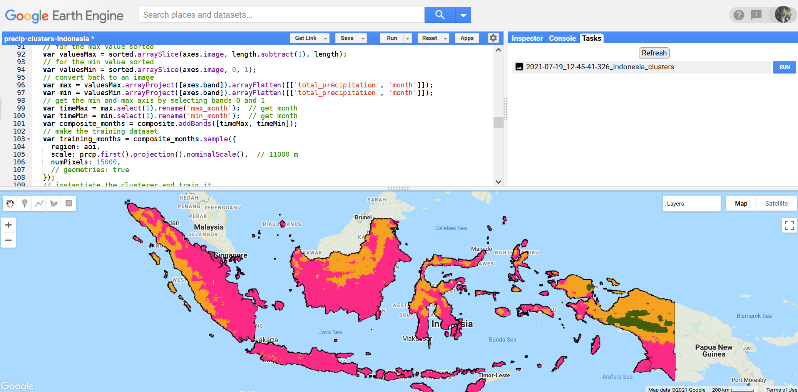

# Identifying climatic regions in Indonesia

This code is used in an scholarly publication on wildfires in Indonesia. It is developed to be run inside the [Google Earth Engine](https://earthengine.google.com/) platform. You need to have both Google (Gmail) and Google Earth Engine accounts in order to use it.

The code allows studying the precipitation distribution for the whole Indonesia by making clusters from [ERA5-Land monthly averaged - ECMWF climate reanalysis](https://developers.google.com/earth-engine/datasets/catalog/ECMWF_ERA5_LAND_MONTHLY) data. You are free to change input variables, such as the period for data clustering or area of interest.

In its current realization, it computes three clusters based on a *total precipitation* band and saves the result as a GeoTiff file (WGS84).

## Code structure

The script (`code.js`) is divided into distinct sections:

1. **Input variables**
    - Area of interest
    - Data
    - Period
    - Styling & display
    - Export
2. **Functions**
3. **Implementation**
    - Data preparation
    - Clustering *- perform k-means clustering*
4. **Visualization**
    - Console *- print statistics about identified clusters*
    - Basemap *- change default basemap to something dimmer*
    - Computed layers *- add newly created layers to the map*
    - Legend *- create and add a legend to the map*
5. **Export** *- save GeoTIFF to your Google Drive folder*

## Developers

  - [Vasily Lobanov](https://www.linkedin.com/in/lobanov-v/), RUDN University, Moscow
  - [Yaroslav Vasyunin](https://www.linkedin.com/in/vasyunin), independent researcher, Italy

## License

This project is licensed under the [GNU General Public License v3.0](https://github.com/y-vasyunin/ee-idn-precip-clusters/blob/main/LICENSE).
