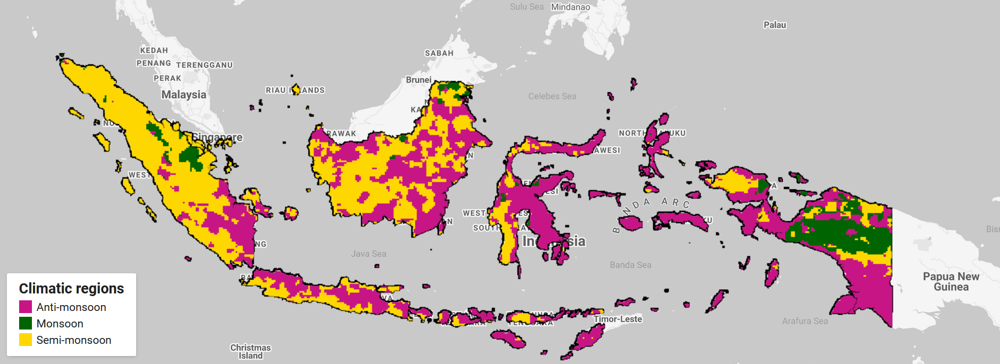

# Precipitation Clusters in Indonesia

Code used in a publication on wildfires in Indonesia. It is developed to be run inside the [Google Earth Engine](https://earthengine.google.com/) platform. You need to have both Google (Gmail) and Google Earth Engine accounts in order to use it.

The code allows studying the distribution of precipitation distribution for the whole Indonesia by making clusters from [ERA5 Monthly aggregates - Latest climate reanalysis produced by ECMWF / Copernicus Climate Change Service](https://developers.google.com/earth-engine/datasets/catalog/ECMWF_ERA5_MONTHLY) data. You are free to change input variables, such as the period for data clustering or area of interest.

## Developers

  - [Vasily Lobanov](https://www.linkedin.com/in/vasyunin)
  - [Yaroslav Vasyunin](https://www.linkedin.com/in/lobanov-v/)

## License

This project is licensed under the [GNU General Public License v3.0](https://github.com/y-vasyunin/ee-idn-precip-clusters/blob/main/LICENSE).
